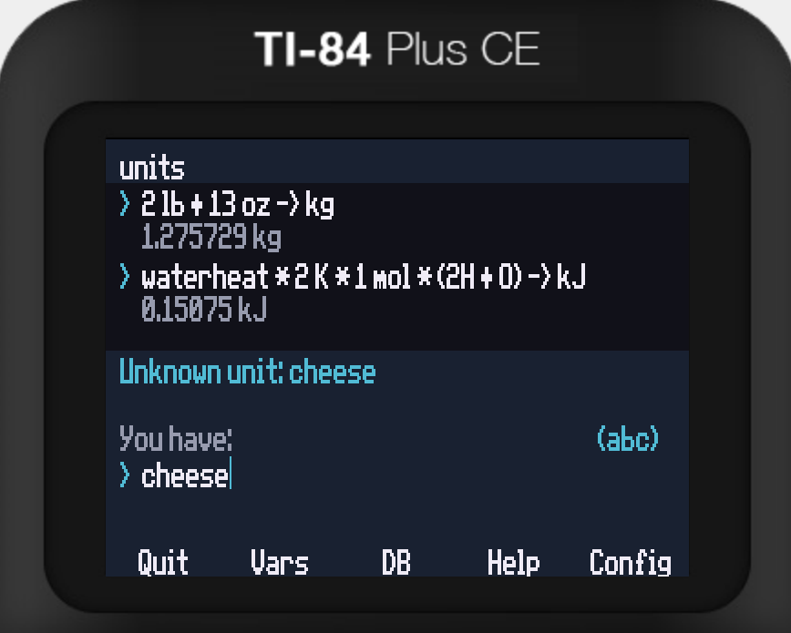

# units for TI-84 Plus CE

modeled after the amazing unit calculator, GNU Units!!

featuring...

### Quick install
1. [Jailbreak](https://yvantt.github.io/arTIfiCE/) your calculator if its OS version >=5.5
2. use [TI Connect CE](https://education.ti.com/en/products/computer-software/ti-connect-ce-sw) to upload the files from `bin/` to your calculator.
3. To run, select `prgm`, `UNITS`.

### Usage

Enter a quantity at **You have**, then a target unit at **You want**. Leave the target blank to show the definition. For example, `3 ft + 6 inch` to `m`.

Use F1-F5 buttons to navigate between pages. Press F4 (Help) for specific controls.

### Workflow
* Install [CE C/C++ Toolchain](https://ce-programming.github.io/toolchain/static/getting-started.html)
* Install [CeMU emulator](https://github.com/CE-Programming/CEmu/releases/tag/v2.0) for easy testing (requires a ROM dump from your physical calculator)
* `make` to compile to `bin/`

Note: `bin/clibs.8xg` is a library downloaded from [here](https://tiny.cc/clibs)